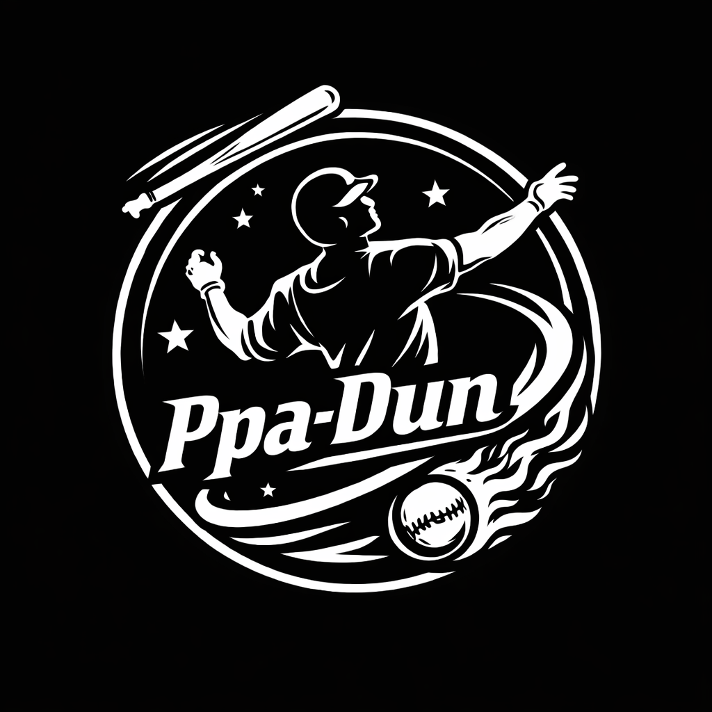

# PPA-DUN

**Player Performance Analytics for Fantasy Baseball**

[Draft Kit](https://ppa-dun.site) · [API Service](https://api.ppa-dun.site)

---

## What we build

PPA-DUN is two products built around our fantasy baseball player-value algorithm.

### 🏟 PPA-DUN Draft Kit
A solo draft companion that helps fantasy baseball managers build a winning roster — live player values, depth charts, injury status, and AI-powered comparisons.

→ **[ppa-dun.site](https://ppa-dun.site)** · [`PPA-DUN-fe`](https://github.com/Ppa-Dun-project/PPA-DUN-fe) · [`PPA-DUN-be`](https://github.com/Ppa-Dun-project/PPA-DUN-be)

### 📊 PPA-DUN API
Our player value & bid recommendation algorithm, exposed as a REST API for developers and other fantasy platforms to license.

→ **[api.ppa-dun.site](https://api.ppa-dun.site)** · [`PPA-DUN-api`](https://github.com/Ppa-Dun-project/PPA-DUN-api)

---

## Repositories

| Repo | Description |
|------|-------------|
| [`PPA-DUN-fe`](https://github.com/Ppa-Dun-project/PPA-DUN-fe) | Draft Kit frontend (React + Vite + TS) |
| [`PPA-DUN-be`](https://github.com/Ppa-Dun-project/PPA-DUN-be) | Draft Kit backend (FastAPI + MySQL) |
| [`PPA-DUN-api`](https://github.com/Ppa-Dun-project/PPA-DUN-api) | API service: algorithm + auth + landing site |
| [`PPA-DUN-cloud`](https://github.com/Ppa-Dun-project/PPA-DUN-cloud) | Infrastructure (Kubernetes, Docker Compose, CI) |

---

## Team

| Name | GitHub | Role |
|------|--------|------|
| **Sanghyun Jun** | [@halfmoon01](https://github.com/halfmoon01) | Infrastructure Lead — GKE / CI-CD / deployments, full-stack contributor |
| **Hochan Jun** | [@Hojjan](https://github.com/Hojjan) | Draft Kit Backend Lead — FastAPI service, draft logic, auth |
| **Yejun Lee** | [@Yejun620](https://github.com/Yejun620) | Draft Kit Frontend Lead — React UI, draft flow, UX |
| **Myungjun Kim** | [@papasb](https://github.com/papasb) | API Algorithm Lead — player-value & bid math, licensed API service |

---

## Tech Stack

**Frontend** — React · TypeScript · Vite · Tailwind CSS

**Backend** — FastAPI · SQLAlchemy · PyMySQL · APScheduler · SlowAPI

**Data & AI** — MySQL · Vertex AI (Gemini) for player comparisons

**Infrastructure** — Google Cloud (Compute Engine, GKE) · Docker Compose · nginx · GitHub Actions · Discord webhooks · Google OAuth

---

Built by the PPA-DUN team · Stony Brook University CSE 416

